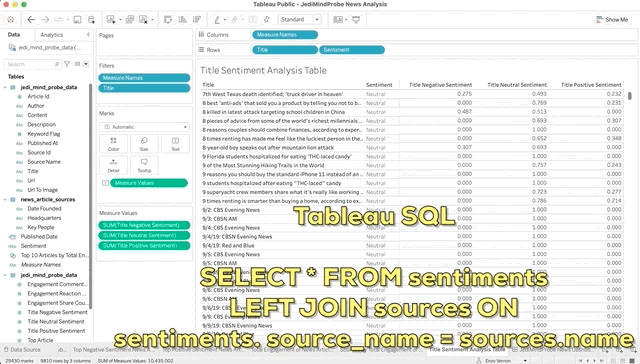
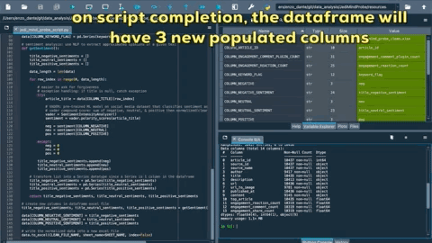
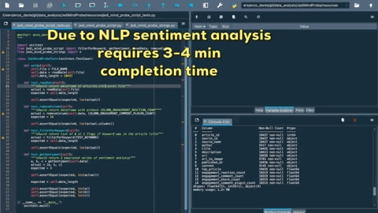
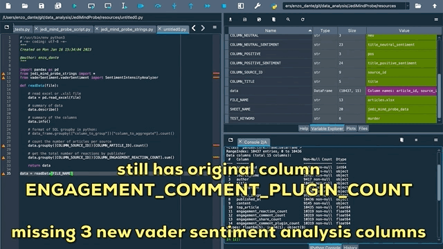

# PR Code Change Description:

### frontend

Tableau Public Dashboard Link:

https://public.tableau.com/app/profile/enzo.vernon/viz/JediMindProbeNewsAnalysis/JediMindProbeNewsDashboard?publish=yes

### backend
1. running jedi_mind_probe_script.py will analyze sentiment of news article titles based on a filtered keyword and export a clean excel file with new columns based on VADER sentiment analysis

# Functional Impacts:
1. build a Tableau dashboard that visualizes Performance & Sentiment Analysis

# QA Reminders:
1. I used the Spyder python IDE via the Anaconda-Navigator application to write, test, & execute the jedi_mind_probe_script.py file.
2. running jedi_mind_probe_script_tests.py will take 3-4 min to complete due to VADER sentiment analysis of article titles.

The link to published tableau dashboard for testing below:

https://public.tableau.com/app/profile/enzo.vernon/viz/JediMindProbeNewsAnalysis/JediMindProbeNewsDashboard?publish=yes

# Acceptance Criteria:
1. write an MVP that extracts sentiments of news article titles & can be filtered by a keyword
2. write a script that will export a clean excel file with new columns based on the sentiment analysis findings
3. use tableau to SQL join multiple datasets together to produce the relevant meaning and visualize your findings into a publicly-published dashboard that can filter the dataset by news source & publish date

### story reference:
https://github.com/enzo-dante/JediMindProbe

# Build Tests:

### python unit_tests

### jest
n/a

### angular
n/a

# Before:

# After:

# Kanban Board:

### TO-DO